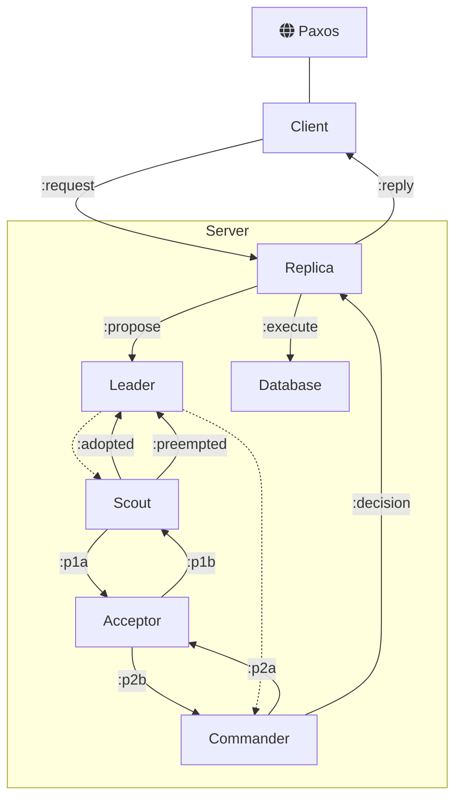

# multi-paxos-in-elixir

Distributed Algorithms 347
Coursework 2

```mermaid
graph TB
Paxos[fa:fa-globe Paxos] --- Client[Client]
subgraph Server
  Replica -->|:propose| Leader
  Leader -.-> Scout
  Scout -->|:adopted| Leader
  Scout -->|:preempted| Leader
  Scout -->|:p1a| Acceptor
  Acceptor -->|:p1b| Scout
  Acceptor -->|:p2b| Commander
  Leader -.-> Commander
  Commander -->|:p2a| Acceptor
  Commander -->|:decision| Replica
  Replica[Replica] -->|:execute| Database[Database]
end
Client -->|:request| Replica
Replica -->|:reply| Client
```

