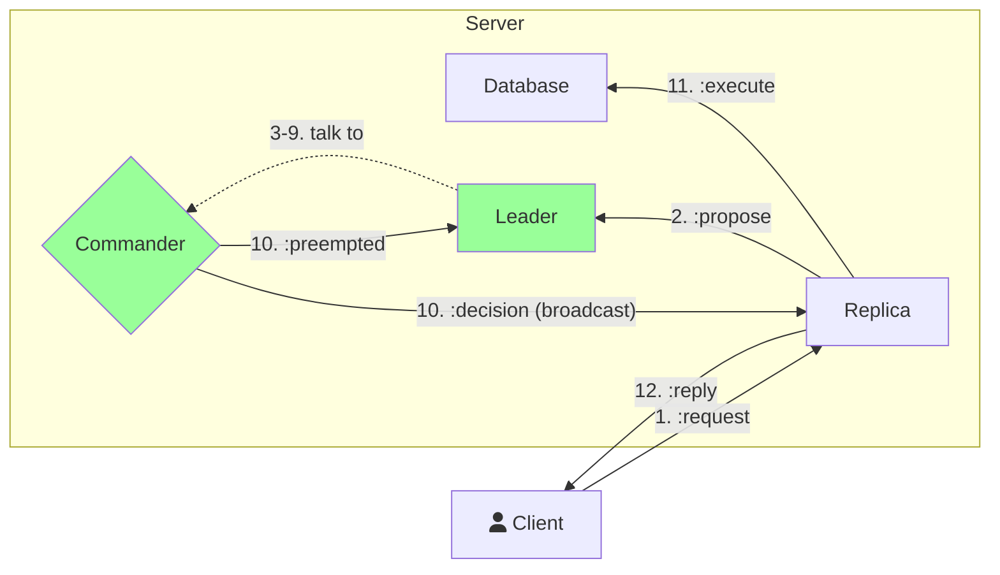
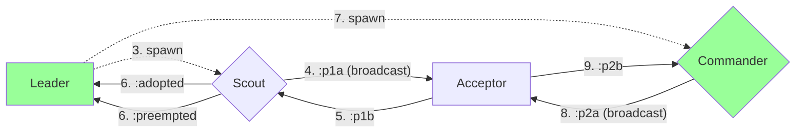
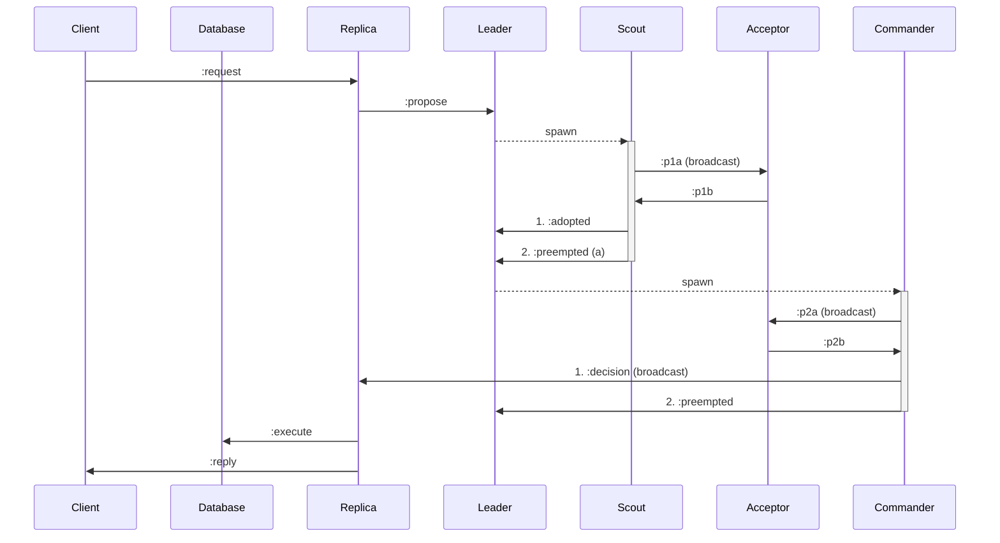

# Distributed Algorithms 347

## Coursework 2

### Thibault Meunier (ttm17)

### Introduction

#### Setup

All code mentioned in the current paper were run with the following configuration

| Computer       | Xiaomi Notebook Air  |
| -------------- | -------------------- |
| Processor      | Intel Core 2.3GHz x4 |
| OS             | Debian Buster64-bit  |
| Memory         | 7.7 GiB              |
| Elixir         | 1.3.3                |
| Docker         | 17.12.0-ce           |
| Docker-compose | 1.17.1               |

### System Structure

#### Flowchart

The flowchart is divided in two distinct ones for the sake of clarity.

#### Sequence diagram

### Implementation and evaluation

#### Tests

+ Number of requests $$

+ Number of Clients $C$
+ Number of Servers $S$
+ Size of the Window $W$
+ Sending Rate (ms) $R$

We look at the response time (ms) $T$

#### $N=?,C=2, S=3, W=5, R=5$

| $N$  | $T$                              |
| ---- | -------------------------------- |
| 100  | $1000$                           |
| 1000 | $614000$                         |
| 2000 | $2701000 \approx 45\mathrm{min}$ |

The system is slow. It is because in the Paxos paper, a `Leader` should spawn $O\left(\#\mathrm{proposals}\right)​$ `Commander`. Then to perform $500​$ requests, the algorithm spawns about $250000​$ `Commander`. After the commander is not needed, I kill but it would be better to reuse it.

#### $N=500, C=?, S=3, W=5, R=5$

| $C$  | $T$     |
| ---- | ------- |
| 2    | $44000$ |
| 10   | $45000$ |
| 100  | $32000$ |

Surprisingly, the number of client has a positive impact on the response time. The more client there is the faster the response time. It may be due to a 

#### $N=500, C=2, S=?, W=5, R=5$

| $S$  | $T$                              |
| ---- | -------------------------------- |
| 1    | $2000$                           |
| 3    | $44000$                          |
| 10   | $1873000 \approx 30\mathrm{min}$ |

The more server there is the more difficult it is for them to synchronise them.

#### $N=500, C=2, S=3, W=?, R=5$

| $W$  | $T$      |
| ---- | -------- |
| 1    | $429000$ |
| 5    | $44000$  |
| 100  | $4000$   |

Window size has a massive impact on the performance of the algorithm. It is because it allows to perform more operation in parallel.

#### $N=500, C=2, S=3, W=5, R=?$

| $R$  | $T$                       |
| ---- | ------------------------- |
| 50   | Never performed ($N=389$) |
| 500  | Never perform ($N=37$)    |
| 5000 | Never performed ($N=1$)   |

Client doesn't have time to perform all of its $250$ requests if the sleeps. This sleep time may be random, then it reflects that the infrastructure the client is running on should be reliable.